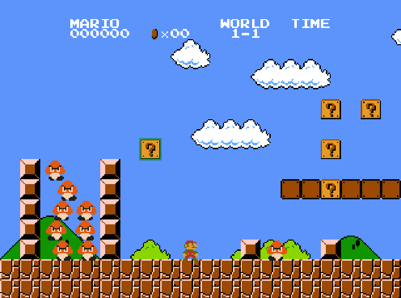

# Super Mario Bros JS

Super Mario Bros level 1-1 in Javascript using P5.JS and QuadTrees

## Controls: 
**Arrow Keys:** moves the player.

**Left-click:** Add block to level.

**Right-click:** Remove block from level.

**Scroll:** Select block.

**Enter:** Pause/unpause the game.

## Link:
https://gustavohubner.github.io/p5-MarioJS-GC/

